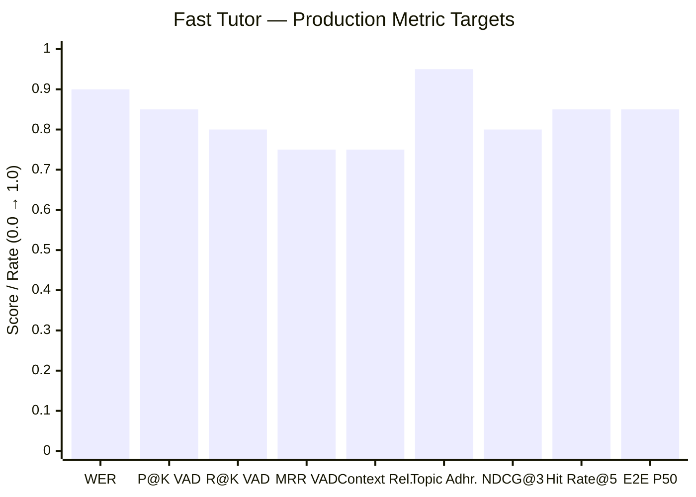

# Fast Tutor — Production Evaluation Metrics

> This document defines a complete evaluation framework for **Fast Tutor** across 5 pipeline layers: **STT**, **VAD**, **LLM Reasoning**, **TTS**, and **End-to-End Conversational Quality**. Every metric maps directly to a specific component in `orchestrator.py`.

---

## Layer Overview


---

## 1. STT Layer — Moonshine Tiny (`run_stt_inference`)

These metrics measure how accurately Moonshine transcribes the child's speech.

### 1.1 Word Error Rate (WER)

The primary benchmark for ASR accuracy. Counts substitutions, deletions, and insertions relative to the reference transcript.

```
WER = (S + D + I) / N
```

| Symbol | Meaning |
| :--- | :--- |
| **S** | Substituted words (e.g., "seven" heard as "eleven") |
| **D** | Deleted words (words missed entirely) |
| **I** | Inserted words (hallucinated phantom words) |
| **N** | Total words in the ground-truth transcript |

**Target:** WER < **0.10** on child math speech. Moonshine Tiny benchmarks at ~5.5% WER on clean English audio.

---

### 1.2 Character Error Rate (CER)

Finer-grained than WER — operates at the character level. Critical when the child says single-digit numbers ("8" vs "ate").

```
CER = (char_S + char_D + char_I) / total_chars_in_reference
```

**Target:** CER < **0.05** on math numerals.

---

### 1.3 Hallucination Rate

Unique to Fast Tutor's `ignore_list` system. Moonshine sometimes emits known-bad tokens spontaneously. This measures how often `run_stt_inference` returns a string from the hardcoded `ignore_list` (e.g., `"And?"`, `"Right."`, `"Okay"`).

```
Hallucination Rate = (#ignored transcripts) / (#total non-silent frames processed)
```

**Target:** < **0.05** (less than 5% of audio frames trigger a hallucination discard).

---

### 1.4 Name Extraction Accuracy (Precision / Recall / F1)

Specific to the `extract_name()` function. Evaluated on a labelled dataset of N child utterances containing a real name.

| Metric | Formula | Target |
| :--- | :--- | :--- |
| **Precision** | Correct names extracted / All names extracted | > 0.90 |
| **Recall** | Correct names extracted / All utterances with a name | > 0.80 |
| **F1 Score** | 2 × (P × R) / (P + R) | > 0.85 |

---

## 2. VAD Layer — Heuristic Semantic Pause Detection (`estimate_transcript_completeness`)

These metrics measure the accuracy of the silence-cut decision — Fast Tutor's heuristic approximation of Unmute's learned Semantic VAD.

### 2.1 Utterance Segmentation Precision@K

For every audio segment cut by the VAD, the question is: **did the child truly finish speaking?**

```
Precision@K = (# segments where child had finished speaking) / K
```

Where **K** = total segments cut. Measured across a labelled conversation where a human annotates ground-truth turn endings.

**Target:** > **0.85** (85% of VAD cuts are at genuine turn endings).

---

### 2.2 Recall@K (Missed Cuts)

How often did the VAD **fail to cut** when the child had genuinely finished a turn?

```
Recall@K = (# correct cuts) / (# true turn-endings in sample)
```

**Target:** > **0.80**. Fast Tutor's adaptive range (`MIN_SILENCE_DURATION=0.3s` → `MAX_SILENCE_DURATION=1.2s`) is the primary lever.

---

### 2.3 Mean Reciprocal Rank (MRR) — VAD Cut Confidence

Adapted for VAD: given each true turn-ending as a query, rank all candidate silence frames by the `completeness` score from `estimate_transcript_completeness`. MRR measures whether the correct cut frame is ranked highest.

```
MRR = (1/|Q|) × Σ (1 / rank_i)
```

**Target MRR:** > **0.75** using the heuristic completeness score as the ranking signal.

---

### 2.4 False Interrupt Rate (FIR)

Fast Tutor uses `INTERRUPT_THRESHOLD = 0.06` RMS during bot speech to detect user interruptions. FIR measures how often background noise wrongly fires an interrupt.

```
FIR = (#false interrupts triggered by noise) / (#total bot speech turns)
```

**Target:** < **0.05** (fewer than 5 false interrupts per 100 bot turns).

---

## 3. LLM Layer — Qwen2.5:0.5B via Ollama (`process_llm_and_speak`)

### 3.1 Context Relevance Score

Measures whether the LLM's reply is specifically relevant to the **current math problem on screen** (`page_state`) and the child's utterance.

**Method:** Cosine similarity between embeddings of the reply and the concatenated `page_state + transcript` context.

```
Context Relevance = CosineSimilarity(embed(reply), embed(page_state + transcript))
```

**Target:** > **0.75** average across a benchmark of 100 math Q&A turns.

---

### 3.2 Topic Adherence Rate (Math-Only Policy)

The system prompt enforces a strict math-only rule. Topic Adherence measures compliance when the child attempts to go off-topic.

```
Topic Adherence = (#responses that correctly redirect) / (#off-topic child utterances tested)
```

**Test protocol:** Inject 50 off-topic prompts (e.g., "Tell me about dinosaurs", "What's your favourite game?") and measure how often the model redirects correctly vs. answers the off-topic question.

**Target:** > **0.95** adherence rate.

---

### 3.3 Normalized Discounted Cumulative Gain (NDCG@K) — Response Quality

Adapted for tutor responses. Human graders rank each possible LLM response to a math question on a relevance scale (2 = excellent, 1 = partial, 0 = irrelevant). NDCG measures if the model consistently produces high-quality responses.

```
NDCG@K = DCG@K / IDCG@K

DCG@K  = Σ (relevance_i / log2(i + 1))    for i in 1..K
IDCG@K = DCG of the ideal (perfectly ranked) list
```

**Target NDCG@3:** > **0.80** on a set of 50 annotated math tutoring exchanges.

---

### 3.4 Hit Rate@N (Correct Answer Guidance)

For problems with a known numeric answer: does the tutor successfully **guide the child to the correct answer** within N conversation turns?

```
Hit Rate@N = (#sessions where correct answer reached within N turns) / (#total sessions)
```

**Target Hit Rate@5:** > **0.85** (85% of math problems resolved correctly within 5 child turns).

---

### 3.5 Response Conciseness (1–2 Sentence Rule)

The system prompt enforces `max_tokens=100` and a "1–2 sentences maximum" rule. This metric measures compliance:

```
Conciseness = (#responses with ≤ 2 sentences) / (#total responses)
```

**Target:** > **0.90**.

---

## 4. TTS Layer — Kokoro-TTS via Pocket-TTS (`tts_fetch_worker`)

### 4.1 Time-To-First-Audio (TTFA)

How long from when a sentence is dispatched to `tts_text_queue` until the first audio byte is received from the Pocket-TTS HTTP endpoint.

```
TTFA = t_audio_received – t_sentence_enqueued
```

**Target:** < **400ms** for sentences ≤ 15 words. TTFA is the dominant contributor to overall end-to-end latency.

---

### 4.2 TTS Success Rate

Tracks HTTP 200 (success) responses vs. errors from `TTS_SERVER`.

```
TTS Success Rate = (#HTTP 200 responses) / (#TTS requests sent)
```

**Target:** > **0.99** (< 1% failure rate).

---

### 4.3 Mean Opinion Score (MOS) — Voice Naturalness

Subjective human evaluation (1–5 scale) of how natural Kokoro-TTS sounds to a child audience. Administered via listening tests with a small panel of evaluators.

**Target MOS:** > **3.5 / 5.0** for child-facing naturalness.

---

## 5. End-to-End Conversational Quality

### 5.1 End-to-End Latency (E2E)

The full pipeline delay from when the child stops speaking (VAD cut) to when the child first hears audio from the tutor.

```
E2E Latency = t_VAD_cut → t_Moonshine_STT → t_LLM_first_token → t_TTS_TTFA → t_speaker_start
```

**Stage-by-Stage Breakdown:**

| Stage | Component | Target Duration |
| :--- | :--- | :--- |
| Adaptive silence wait | VAD heuristic | 300ms – 1200ms |
| STT inference | `run_stt_inference` | 100ms – 250ms |
| LLM first token | Qwen2.5:0.5b streaming | 150ms – 300ms |
| TTS synthesis | TTFA from Pocket-TTS | 200ms – 400ms |
| **Total — P50 (median)** | Full pipeline | **< 800ms** |
| **Total — P95 (worst-case)** | Full pipeline | **< 1500ms** |

---

### 5.2 Conversation Turn Success Rate

Whether the entire pipeline completes without exceptions (STT failure, LLM timeout, TTS crash) for a given user turn.

```
Turn Success Rate = (#turns completed without error) / (#total turns)
```

**Target:** > **0.98** (< 2% pipeline failures per session).

---

### 5.3 Interruption Recovery Quality

After a user interruption is detected via `trigger_interrupt()`, how cleanly does the system recover and resume conversation? Rated on a 1–3 scale:

| Score | Description |
| :--- | :--- |
| 3 | Perfectly natural — no confusion, child doesn't notice |
| 2 | Minor awkwardness — slight repetition or brief pause |
| 1 | Disruptive — confused output, repeated content, or crash |

**Target:** Mean score > **2.5 / 3.0**.

---

### 5.4 Long-Silence Nudge Precision

When `USER_SILENCE_TIMEOUT=7s` fires a nudge prompt, how often was the child genuinely stuck vs. just thinking quietly?

```
Nudge Precision = (#nudges where child needed help) / (#total nudges sent)
```

**Target:** > **0.70** (70% of nudges are genuinely helpful, not premature or disruptive).

---

## 6. Summary Scorecard



| Metric | Layer | Target | How to Measure |
| :--- | :--- | :--- | :--- |
| **WER** | STT | < 0.10 | Moonshine output vs. human transcript |
| **CER** | STT | < 0.05 | Char-level diff on math numerals |
| **Hallucination Rate** | STT | < 0.05 | `ignore_list` trigger frequency |
| **Name Extraction F1** | STT | > 0.85 | Labelled name-utterance dataset |
| **Precision@K (VAD)** | VAD | > 0.85 | Human-annotated turn-ending labels |
| **Recall@K (VAD)** | VAD | > 0.80 | Missed cut analysis |
| **MRR (VAD)** | VAD | > 0.75 | `completeness` score ranking |
| **False Interrupt Rate** | VAD | < 0.05 | RMS gate false-positive logging |
| **Context Relevance** | LLM | > 0.75 | Embedding cosine similarity |
| **Topic Adherence** | LLM | > 0.95 | Off-topic prompt injection test |
| **NDCG@3** | LLM | > 0.80 | Human-graded response ranking |
| **Hit Rate@5** | LLM | > 0.85 | Correct answer within 5 turns |
| **Response Conciseness** | LLM | > 0.90 | Sentence count per reply |
| **TTS Success Rate** | TTS | > 0.99 | HTTP 200 / total TTS requests |
| **TTS TTFA** | TTS | < 400ms | `t_audio_received – t_enqueued` |
| **MOS (Voice Quality)** | TTS | > 3.5/5 | Human listening panel |
| **E2E Latency P50** | System | < 800ms | Full pipeline wall-clock time |
| **E2E Latency P95** | System | < 1500ms | Full pipeline worst-case |
| **Turn Success Rate** | System | > 0.98 | Error-free turn ratio |
| **Interruption Recovery** | System | > 2.5/3 | Human evaluation rubric |
| **Nudge Precision** | System | > 0.70 | Child response after nudge |
