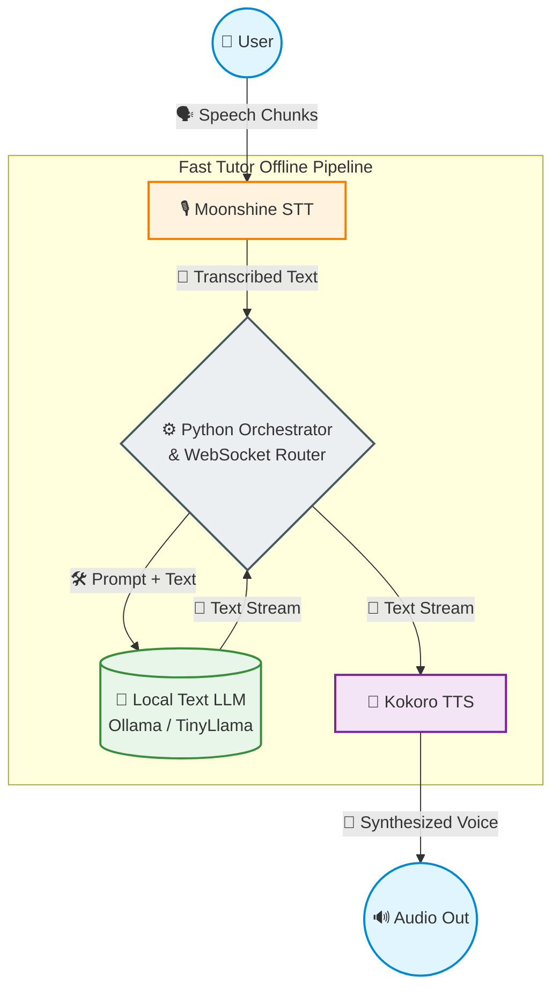
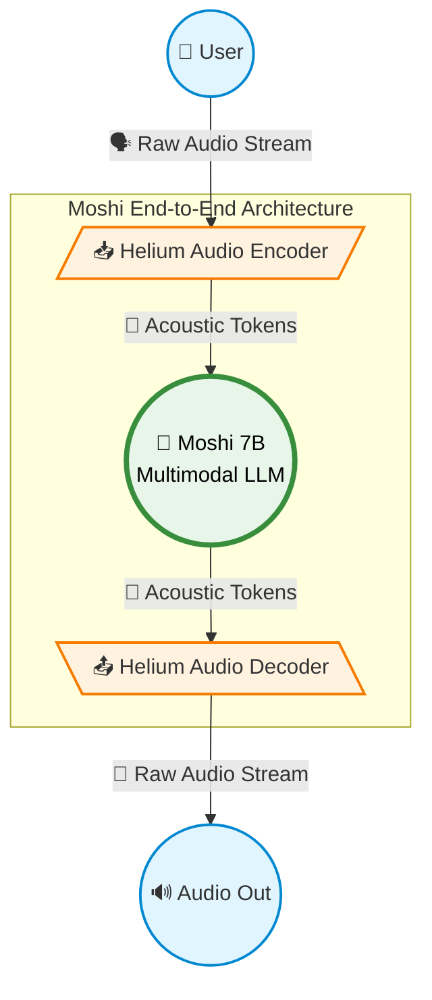
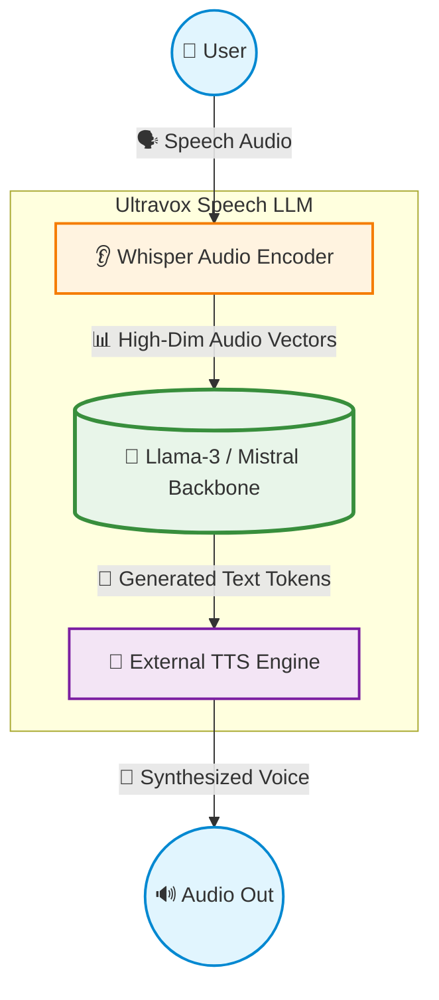
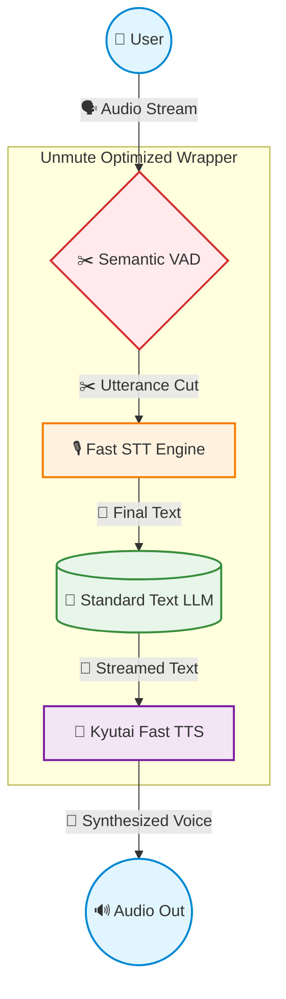

# Comprehensive Voice AI Architecture Comparison

This document provides a detailed technical comparison between **Our System (Fast Tutor)**, **Moshi (Kyutai)**, **Ultravox (Fixie.ai)**, and **Unmute (Kyutai)**. It evaluates each system along four critical axes: **Design**, **Resource Usage**, **Speed (Latency)**, and **Accuracy**.

---

## 1. System Design and Architecture

The fundamental differences between these systems lie in how they process speech input and output. Broadly, they fall into two categories: **Cascaded Systems** (modular pipelines) and **Native/Multimodal Models** (end-to-end networks).

### Our System (Fast Tutor)

* **Architecture:** Offline, Event-Driven Cascaded Pipeline.
* **Component Flow:** 
  * **STT:** Moonshine (highly optimized, low-footprint speech-to-text).
  * **LLM Engine:** Local Python Orchestrator routing to a lightweight local LLM (e.g., via Ollama). Employs strict prompt engineering for math-focussed, concise answers.
  * **TTS:** Localized TTS (e.g., Kokoro-TTS).
* **System Design:** Held together by a Python WebSocket orchestrator that talks directly to an interactive HTML/JS front-end. It emphasizes total offline capability, modularity, and tight control over the conversation flow without relying on third-party API networks.

### Moshi (by Kyutai)

* **Architecture:** Native End-to-End Speech-to-Speech AI.
* **Component Flow:** Pure Multimodal. Moshi does not transcribe speech to text. Instead, it processes raw audio directly into semantic tokens and hallucinates raw audio outputs (using Helium/Mimi audio codecs) interleaved with text representations. 
* **System Design:** Fully integrated model capable of true full-duplex communication. It can listen to you *while* it speaks, handling interruptions flawlessly.

### Ultravox (by Fixie.ai)

* **Architecture:** Multimodal Speech Large Language Model (Speech-to-Text LLM).
* **Component Flow:** 
  * **Audio Encoding:** Direct-to-LLM audio processing (combines Whisper's audio encoder directly into a Llama-3 or Mistral backbone).
  * **Text Output:** The model natively understands audio inputs (bypassing a separate STT phase) but outputs text.
  * **TTS:** Requires a separate Text-to-Speech engine attached to the end to converse vocally.
* **System Design:** It eliminates the latency and error-propagation of an STT pipeline by encoding audio features directly to LLM tokens. It supports tool-calling and RAG.

### Unmute (by Kyutai)

* **Architecture:** Optimized Orchestration Wrapper (Cascaded Pipeline).
* **Component Flow:**
  * **VAD:** Semantic Voice Activity Detection (intelligently detects when the user finishes speaking).
  * **STT -> LLM -> TTS:** Connects high-performance standard cloud or local text LLMs to fast STT and TTS engines.
* **System Design:** Unmute is not a model, but a framework. It attempts to squeeze maximum speed out of a traditional cascaded pipeline (like Our System) by streaming chunks aggressively between independent STT, LLM, and TTS processes.

---

## 2. Resource Usage

| System | Primary Resource Constraint | VRAM/Memory Footprint | Deployment Scope |
| :--- | :--- | :--- | :--- |
| **Our System** | Highly Scalable / Modular | **Very Low to Modest (2GB - 8GB)** | Runs efficiently on low-end consumer hardware (laptops, Apple Silicon, older GPUs), or mostly CPU. Depends heavily on the chosen local text LLM. |
| **Moshi** | Heavy GPU Requirement | **High (~8GB - 16GB+ VRAM)** | As a 7B parameter multimodal model, it requires a dedicated AI accelerator / heavy GPU to run inference locally at real-time speeds. |
| **Ultravox** | Moderate-to-Heavy GPU | **High (~16GB VRAM)** | Usually built on top of 8B Llama-3 models. Requires substantial memory just to load the LLM and the attached audio encoder. |
| **Unmute** | Modular (Depends on models) | **Variable** | Since it acts as a wrapper, it can be lightweight if calling API endpoints, or highly resource-intensive if running its STT, LLM, and TTS fully locally simultaneously. |

**Summary:** 
Our System wins on minimum viable footprint. By leveraging Moonshine STT and lightweight routing, we can run completely offline on modest hardware where Moshi or Ultravox would fundamentally crash or fail to achieve real-time streaming speeds.

---

## 3. Speed and Latency

Latency in voice AI includes Time-To-First-Byte (TTFB) and full dialogue turnaround time.

1. **Moshi (Fastest):** Operates under **~200ms latency**. Because it is a native Speech-to-Speech model, it requires zero time for text transduction. It begins generating audio responses virtually instantly, rivaling human reflex time.
2. **Our System (Highly Competitive):** Optimized for **~400ms - 800ms**. While a cascaded system inherently faces "pipeline tax", our use of streaming Moonshine STT buffers and WebSocket chunking minimizes idle time. It generates text and triggers the TTS stream much faster than standard cascade. 
3. **Ultravox (Fast):** By omitting the STT transcription step, it saves roughly 300ms associated with traditional ASR. However, it still must stream its text generation into a TTS engine. Latency is generally around **~500ms - 700ms**.
4. **Unmute (Fast for Cascade):** Minimizes latency purely through "Semantic VAD" (predicting when a user intends to stop speaking rather than waiting for silence). Typically clocks in around **~600ms - 1000ms** depending on the backbone LLM speed.

---

## 4. Accuracy and Output Quality

Different architectures handle audio nuances, reasoning, and context differently.

### Reasoning and Mathematical Accuracy
* **Our System:** **Highest for specific constraints.** Because we pass clean text to an LLM, we can inject very strict system prompts (e.g., "Answer only math questions"). Local LLMs tuned for reasoning will outperform multimodal audio models on raw logic tasks.
* **Ultravox:** **High.** Utilizes Llama-3 or Mistral backbones. Excellent at reasoning tasks and function calling, processing the context with standard top-tier instruction following.
* **Moshi & Unmute:** **Moderate to Good.** End-to-end models like Moshi can sometimes struggle with deep logical reasoning because parameters are heavily dedicated to acoustic mapping, whereas text-first systems dedicate all compute to logic.

### Acoustic Understaning (Emotion, Tone, Interruptions)
* **Moshi:** **Flawless.** Natively understands tone of voice, background noise, and allows you to seamlessly interrupt it mid-sentence.
* **Ultravox:** **Excellent.** Reads the tone and non-verbal cues (like sighs or hesitations) directly from the audio encoder, providing richer context to the LLM than a flat transcript.
* **Our System & Unmute:** **Limited.** As cascaded pipelines, STT flattens all audio into plain text. The LLM cannot hear the user's emotion, sarcasm, or background context. Interruptions have to be manually handled by cutting the STT/TTS buffers abruptly.

---

## Conclusion & Architectural Verdict

If the goal is to build a **Local, Math-Focused AI Tutor**:

1. **Our System vs. Moshi:** Moshi provides an incredible conversational experience but is too resource-hungry and hard to restrict behaviorally (preventing it from answering off-topic). Our System gives us tight logical control, strict rule enforcement, and a footprint small enough for consumer devices. 
2. **Our System vs. Ultravox:** Ultravox is an incredible middle-ground (skipping STT), but still requires heavy GPU hardware (16GB VRAM) for local deployment. Fast Tutor's Moonshine STT is more adaptable for lower-end offline laptops.
3. **Our System vs. Unmute:** Unmute validates our design pattern. Both Fast Tutor and Unmute prove that properly orchestrated, streaming cascaded pipelines (STT -> LLM -> TTS) are currently the most practical, customizable, and reliable way to build specialized voice applications. Our system has the added benefit of being custom-tailored to our exact WebUI and strict educational guardrails.
